# 拒绝采样（Rejection Sampling）— 日志定位指南

> **这是什么**：本指南覆盖 vLLM-Ascend 投机解码（Speculative Decoding）中的拒绝采样模块，包含 AscendRejectionSampler、Triton 算子（reject_sample.py）及 PyTorch Fallback 路径。拒绝采样负责根据目标模型（Target Model）的概率分布对草稿模型（Draft Model）生成的 token 进行接受/拒绝判定，并决定 bonus token 的归属。
>
> **覆盖范围**：从 AscendRejectionSampler.__init__ 到 rejection_sample 返回 output_token_ids，以及后续 RejectionSampler.parse_output 的基本校验。
>
> **涉及组件**：vllm_ascend/sample、vllm_ascend/ops/triton、vllm_ascend/patch/worker、vllm_ascend/_310p/sample（详见 [附录 A](#a-涉及仓库与组件)）
>
> | 术语 | 含义 |
> |------|------|
> | Rejection Sampling | 投机解码中对 draft token 按目标概率进行接受/拒绝采样的算法 |
> | Block Verify | 以块为单位评估所有 draft token 的累积接受概率，提升 acceptance rate |
> | Entropy Verify | 根据目标分布的熵动态调整接受阈值（高熵更宽松、低熵更严格） |
> | Reduce Sample | TP 分布式场景下，先 top-k/top-p 再 all-gather 的降采样方案 |
> | Recovered Token | draft token 被拒绝后，从修正分布中重新采样的替代 token |
> | PLACEHOLDER_TOKEN_ID | -1，表示该位置无有效 draft token |
> | HAS_TRITON | 运行时 Triton 是否可用的标志，决定走 Triton kernel 还是 PyTorch fallback |
> | DFX | Design for Excellence，设计卓越性，包含可观测性、可诊断性、可维护性 |
> | RejectionSamplerDFX | 拒绝采样专用 DFX 模块，提供指标收集、错误码体系、tensor 校验 |
>
> **你需要准备**：
> - 日志文件：通常为标准输出 / 推理服务日志（vllm serve 或 LLM() 的日志流）
> - 快速过滤：grep -E "(rejection_sampler|sample/sampler|RejectionSampler config)" <日志文件>
> - 配置检查：additional_config 中的 rejection_sampler_config 与 enable_reduce_sample
>
> **阅读优先级**：紧急排障 → 直接看下方「判断口诀」；系统了解 → 按 §一 → §二 → 附录顺序读

## 目录
- [一、快速定位](#一快速定位先看这里)
- [二、分阶段详细定位](#二分阶段详细定位)
- [三、卡点速查](#三卡点速查卡在-x--查-y)
- [四、附录](#四附录)
  - [A. 涉及仓库与组件](#a-涉及仓库与组件)
  - [B. 关键配置](#b-关键配置)
  - [C. 全量日志逐步明细](#c-全量日志逐步明细)
  - [D. 全量流程图（Mermaid）](#d-全量流程图mermaid)
  - [E. 关键节点索引](#e-关键节点索引)
  - [F. 故障场景流程](#f-故障场景流程)

## 一、快速定位（先看这里）

> **30 秒速判**：在日志里搜下面几步的标志日志，**最后出现的那条 = 你卡在哪一步**，直接跳对应 §二或 §三。

| 步骤 | 标志日志（grep 关键词） | 正常应接着看到 | 没走到 → | 全量（表→图） |
|------|------------------------|----------------|----------|---------------|
| 1. 初始化 | AscendRejectionSampler initialized | triton_available=True/False | §2.1 / §三-Triton不可用 | [C.1](#c1) → [D.1](#d1) |
| 2. 约束准备 | Using reduce-sample path for apply_sampling_constraints | top-k/top-p with TP all-gather | §2.2 / §三-Reduce未生效 | [C.2](#c2) → [D.2](#d2) |
| 3. 路径确认 | RejectionSampler config: | block_verify=*, entropy_verify=*, reduce_sample=* | §2.3 / §三-配置异常 | [C.3](#c3) → [D.3](#d3) |
| 4. 算子执行 | （无固定日志，看配置推断） | 对应 Triton kernel 或 PyTorch 路径完成 | §2.4 / §三-算子失败 | [C.4](#c4) → [D.4](#d4) |
| 5. 输出校验 | parse_output 无报错 | 输出 token 序列无 -1 | §2.5 / §三-Placeholder泄漏 | [C.5](#c5) → [D.5](#d5) |

> **判断口诀**：
> - 搜 triton_available=False → 性能劣化，查 Triton 环境
> - 搜 fallback (non-reduce-sample) → 分布式路径未生效，查 enable_reduce_sample 与 target_indices
> - 搜 block_verify=True 但 acceptance rate 未提升 → 查 posterior_threshold / posterior_alpha
> - 输出出现 -1 → recovered token 生成失败或 kernel 未正确填充

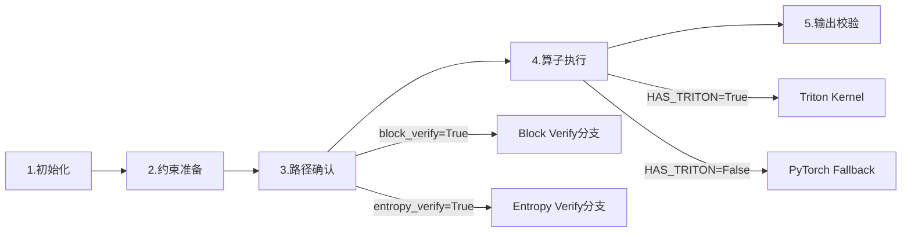

> 跨阶段时序图（多组件交互）见 [D.5](#d5)

## 二、分阶段详细定位

### 2.1 阶段 1：初始化与配置加载

**在干什么**：AscendRejectionSampler 实例化时读取 AscendConfig，确认 enable_reduce_sample、rejection_sampler_config（block_verify、entropy_verify 等）及 HAS_TRITON 状态。这些配置决定后续所有执行分支。

| 子环节 | 关键日志 / 观测点 | 正常含义 | 异常时 / 分支 |
|--------|-------------------|----------|---------------|
| 配置加载 | AscendConfig 初始化无报错 | rejection_sampler_config 已解析 | ValueError：阈值越界或类型错误 |
| Sampler 初始化 | [sample/sampler] AscendSampler initialized | 正常建立基础采样器 | 缺失则上游未启动 |
| RejectionSampler 初始化 | [sample/rejection_sampler] AscendRejectionSampler initialized | ascend_optimizations_enabled=True | triton_available=False 时性能预警 |
| Triton 检测 | HAS_TRITON=True（日志或代码断言） | 可使用 Triton kernel 加速 | False 时走 PyTorch fallback，CPU-NPU 同步增加 |

→ 全量表：[C.1](#c1)
→ 全量流程图：[D.1](#d1)

### 2.2 阶段 2：Target Logits 预处理

**在干什么**：在 forward() 中，先对 bonus logits 做基础采样，再对 target logits 应用 logits processors（penalties、bad words、allowed token ids），然后通过 apply_sampling_constraints 应用 temperature / top-k / top-p。若 enable_reduce_sample=True，会触发 TP all-gather 获取全局 top-k/top-p 结果。

| 子环节 | 关键日志 / 观测点 | 正常含义 | 异常时 / 分支 |
|--------|-------------------|----------|---------------|
| Bonus 采样 | bonus_sampler_output = self.sampler(...) | 正常返回 bonus_token_ids | 若 sampler 异常，日志在上层 |
| Penalties | [sample/rejection_sampler] Triton not available...（fallback） | 使用 Ascend Triton penalties | 回退到 vLLM 默认实现，性能下降 |
| Top-K/Top-P | Using reduce-sample path for apply_sampling_constraints | TP all-gather 后做全局约束 | 未打印则走本地约束，分布式场景可能漏 token |
| Temperature | logits.div_(temperature) | 按 request 级别 temperature 缩放 | GREEDY_TEMPERATURE 被替换为 1 |

→ 全量表：[C.2](#c2)
→ 全量流程图：[D.2](#d2)

### 2.3 阶段 3：拒绝采样主逻辑与路径分发

**在干什么**：rejection_sample() 根据配置和 sampling_metadata 将流量分发到四条主干路径：
1. **Greedy + Triton**：rejection_greedy_sample_with_triton
2. **Greedy + PyTorch**：rejection_greedy_sample_pytorch / rejection_greedy_sample_spec_len_1_pytorch
3. **Random + Block Verify + Triton**：rejection_random_sample_block_verify_kernel
4. **Random + Standard + Triton**：rejection_random_sample_kernel
5. 对应 PyTorch fallback 版本

| 子环节 | 关键日志 / 观测点 | 正常含义 | 异常时 / 分支 |
|--------|-------------------|----------|---------------|
| 路径决策 | Rejection sampling path: block_verify=..., entropy_verify=... | 关键决策参数，确认所有开关状态 | 未出现则 using_block_verify / using_entropy_verify 为 False |
| Reduce Sample | RejectionSampler config: block_verify=... | 配置汇总日志 | False 但 target_indices is not None 时需留意 |
| Fallback 警告 | Using fallback (non-reduce-sample) path | 不应出现于新分布式流 | 出现说明 enable_reduce_sample=True 但 target_indices=None，配置与数据不一致 |
| Entropy Verify | ori_target_probs 被计算 | 使用原始 logits 计算熵 | ori_target_logits is None 时回退到 target_probs |

→ 全量表：[C.3](#c3)
→ 全量流程图：[D.3](#d3)

### 2.4 阶段 4：算子执行（Triton / PyTorch Fallback）

**在干什么**：实际执行接受/拒绝判定。Triton kernel 在 NPU 上并行处理每个 request 的 draft token 序列；PyTorch fallback 使用向量化操作模拟相同逻辑，但可能有更多 CPU-NPU 同步。

| 子环节 | 关键日志 / 观测点 | 正常含义 | 异常时 / 分支 |
|--------|-------------------|----------|---------------|
| Triton Greedy | rejection_greedy_sample_triton 启动 | block 级并行比对 draft 与 target argmax | num_draft_tokens 为 0 时无操作 |
| Triton Random | rejection_random_sample_kernel 启动 | 逐 token 按 target_prob / draft_prob >= uniform_prob 判定 | draft_token_id == -1 直接拒绝 |
| Block Verify | rejection_random_sample_block_verify_kernel 启动 | 累积概率 pi 与累积 uniform 比较 | ENTROPY_VERIFY=True 时 threshold 动态调整 |
| Recovered Tokens | sample_recovered_tokens_kernel 启动 | 从 max(0, target - draft) 分布中采样替代 token | q=0 或 inf 时内部替换为 epsilon |
| PyTorch Fallback | 无日志，通过 HAS_TRITON=False 推断 | 功能正确但性能劣化 | 长序列时同步开销显著 |

> **DFX 提示**：本阶段是**日志空白区**。Triton kernel 内部不打印日志，若发生异常（如非法内存访问、shape mismatch），通常表现为：
> - NPU 报错（ACL / HIPI 底层错误）
> - 进程挂死（busy wait 在 Triton launch）
> - 输出 tensor 含未初始化的值（如 -1 未正确替换）
> **定位手段**：
> 1. 先确认 grid, block_size = cal_grid_and_block_size(batch_size) 的合理性（block_size 为 2 的幂）
> 2. 用 pytorch 路径对比：临时设置 HAS_TRITON=False 验证是否为 kernel 本身问题
> 3. 检查输入 tensor 的 is_contiguous() 和 dtype（torch.float32 for probs）

→ 全量表：[C.4](#c4)
→ 全量流程图：[D.4](#d4)

### 2.5 阶段 5：输出校验与后处理

**在干什么**：rejection_sample 返回 [batch_size, max_spec_len + 1] 的 output_token_ids，其中有效 accepted/recovered tokens 已填充，bonus token 已追加。后续 RejectionSampler.parse_output() 会过滤掉 PLACEHOLDER_TOKEN_ID（-1）并整理为最终输出。

| 子环节 | 关键日志 / 观测点 | 正常含义 | 异常时 / 分支 |
|--------|-------------------|----------|---------------|
| 输出 shape | (batch_size, max_spec_len + 1) | 符合预期 | shape 不匹配时 upstream assert 失败 |
| Placeholder 过滤 | parse_output 过滤 -1 | 最终用户不应看到 -1 | 若 -1 泄漏，说明 parse 逻辑未生效或全为 -1 |
| Logprobs | _get_logprobs_tensors | 返回请求的 logprobs | is_processed_logprobs_mode 影响数据来源 |

> **DFX 提示**：若业务侧发现输出含 -1，直接回溯到 **阶段 4**：
> - output_token_ids.fill_(PLACEHOLDER_TOKEN_ID) 后是否没有任何 kernel 成功写入？
> - 检查 num_draft_tokens 是否全为 0（导致所有位置跳过）
> - 检查 is_greedy mask 是否把非 greedy request 全部屏蔽

→ 全量表：[C.5](#c5)
→ 全量流程图：[D.5](#d5)

## 三、卡点速查（卡在 X → 查 Y）

| 你卡在这里 | 落在哪个大阶段 | 优先查什么 | 常见原因 |
|-----------|---------------|-----------|---------|
| 推理启动即报错 ValueError 含 rejection_sampler_config | 阶段 1 | posterior_threshold / posterior_alpha 类型与范围 | 配置传入字符串或阈值不在 (0,1]；posterior_alpha < 0 |
| 日志中出现 Triton not available | 阶段 1 / 2 | HAS_TRITON 环境、triton 包安装情况 | Triton 未安装或 NPU 驱动不支持；310P 平台预期行为 |
| enable_reduce_sample=True 但打印 fallback (non-reduce-sample) | 阶段 3 | target_indices 是否为 None | apply_top_k_top_p 未返回 indices；AscendTopKTopPSampler 未正确初始化 |
| Block Verify 开启后 accuracy 下降 | 阶段 3 / 4 | posterior_threshold、posterior_alpha | 阈值过低导致过度接受错误 draft；高熵场景 threshold 被 entropy verify 拉得太低 |
| Entropy Verify 未生效 | 阶段 3 / 4 | ori_target_logits 是否存在 | forward() 中 is_processed_logprobs_mode=True 时未保留 raw logits |
| 输出 token 中出现 -1 | 阶段 4 / 5 | output_token_ids 初始填充后是否有 kernel 写入 | kernel launch 失败；num_draft_tokens=0；is_greedy 全为 False 但走了 greedy 路径 |
| Acceptance rate 突然降为 0 | 阶段 4 | target_logits 与 draft_probs 的数值分布 | target 分布与 draft 差异过大；temperature 缩放错误；uniform_probs 生成异常（如全 0） |
| Greedy 结果与单卡不一致 | 阶段 2 / 4 | greedy_sample() 的 TP all-gather | enable_reduce_sample=True 时 tp_group.all_gather 通信异常；rank 不一致 |
| Random 采样结果复现不了 | 阶段 4 | sampling_metadata.generators | generator seed 未固定；async_exponential 事件同步时机问题 |
| 性能比 GPU 基线差很多 | 阶段 4 | HAS_TRITON 与路径选择 | 走了 PyTorch fallback；sample_recovered_tokens 在 CPU 生成 q 导致同步 |
| 310P 平台拒绝采样异常 | 阶段 4 | AscendRejectionSampler310 路径 | 无 Triton，强制 PyTorch；fill_exponential_310p 的 RNG 行为差异 |
| AssertionError 在 rejection_sample 内 | 阶段 3 | tensor shape / contiguous / device | draft_token_ids.ndim != 1；target_logits 非连续；bonus_token_ids 不在 NPU |

> **排查顺序（与 §一 步骤一致）**：
> 1. 先看 AscendRejectionSampler initialized 确认 Triton 和 reduce_sample 状态
> 2. 再看 RejectionSampler config: 确认 block_verify / entropy_verify / all_greedy / all_random
> 3. 检查有无 fallback 或 Triton not available 警告
> 4. 确认输入 tensor shape、device、contiguous 属性
> 5. 若仍无头绪，临时关闭 Triton（HAS_TRITON=False）对比 PyTorch 路径是否复现

## 四、附录

### A. 涉及仓库与组件

| 仓库/子模块 | 文件 | 职责 |
|------------|------|------|
| vllm-ascend / sample | vllm_ascend/sample/rejection_sampler.py | AscendRejectionSampler、rejection_sample、PyTorch fallback 实现 |
| vllm-ascend / sample | vllm_ascend/sample/sampler.py | AscendSampler、AscendTopKTopPSampler、apply_top_k_top_p、greedy_sample |
| vllm-ascend / ops | vllm_ascend/ops/triton/reject_sample.py | Triton kernels：rejection_greedy_sample_triton、rejection_random_sample_kernel、rejection_random_sample_block_verify_kernel、sample_recovered_tokens_kernel、expand_kernel |
| vllm-ascend / patch | vllm_ascend/patch/worker/patch_rejection_sampler.py | Patch：将 apply_sampling_constraints、rejection_sample、expand_batch_to_tokens 注入上游 vLLM |
| vllm-ascend / worker | vllm_ascend/worker/model_runner_v1.py | 调用 AscendRejectionSampler 的入口，组装 spec_decode_metadata |
| vllm-ascend / _310p | vllm_ascend/_310p/sample/rejection_sampler.py | 310P 专用路径：AscendRejectionSampler310，无 Triton，CPU RNG |
| vllm-ascend / worker v2 | vllm_ascend/worker/v2/spec_decode/rejection_sampler_utils.py | v2 模型运行时的 rejection_sample（基于 block stats / gumbel resample） |
| vllm-ascend / config | vllm_ascend/ascend_config.py | RejectionSamplerConfig、enable_reduce_sample 配置解析与校验 |

### B. 关键配置

| 配置项 | 日志体现 | 说明 |
|--------|---------|------|
| additional_config.enable_reduce_sample | reduce_sample=%s（初始化日志） | True 时启用 TP 分布式降采样（all-gather top-k/top-p）；默认 False |
| rejection_sampler_config.enable_block_verify | block_verify=%s | True 时以块为单位做累积接受判定，提升 acceptance rate；要求 max_spec_len >= 3 |
| rejection_sampler_config.enable_entropy_verify | entropy_verify=%s | True 时根据目标分布熵动态调整阈值；需 ori_target_logits |
| rejection_sampler_config.posterior_threshold | posterior_threshold=%s | 熵校验阈值上限，默认 0.95，范围 (0, 1] |
| rejection_sampler_config.posterior_alpha | posterior_alpha=%s | 熵缩放系数，默认 0.4，必须 >= 0 |
| envs.VLLM_BATCH_INVARIANT | BATCH_INVARIANT mode enabled | True 时拒绝采样相关 top-k/top-p 回退到 vLLM 原生实现 |
| HAS_TRITON（运行时自动检测） | triton_available=%s / has_triton=%s | 决定使用 Triton kernel 还是 PyTorch fallback |

> **配置校验规则**（代码硬校验）：
> - enable_block_verify + max_spec_len >= 3 才会真正生效
> - enable_entropy_verify 仅在 random sampling 路径有意义（greedy 路径跳过）
> - enable_reduce_sample=True 但 target_indices is None 会触发 fallback 警告

### C. 全量日志逐步明细

> **阅读链**：§一/§二 → 附录 C → 附录 D

<a id="c1"></a>
#### C.1 阶段 1：初始化与配置加载

← §一步骤 1 · §2.1 · 流程图 → [D.1](#d1)

| 序号 | 子模块 | 日志原文 | 说明 |
|------|--------|---------|------|
| 1 | ascend_config | AscendConfig.enable_reduce_sample is set from additional_config with value {value}. | enable_reduce_sample 从配置读取（条件打印） |
| 2 | ascend_config | AscendConfig.enable_reduce_sample falls back to environment variable VLLM_ASCEND_ENABLE_REDUCE_SAMPLE with value {value}. Please use additional_config.enable_reduce_sample instead... | 从环境变量回退（已废弃，条件打印） |
| 3 | sample/sampler | [sample/sampler] AscendSampler initialized. logprobs_mode=%s, triton_available=%s | AscendSampler 初始化（DEBUG） |
| 4 | sample/rejection_sampler | [sample/rejection_sampler] AscendRejectionSampler initialized. ascend_optimizations_enabled=%s, triton_available=%s, reduce_sample=%s | AscendRejectionSampler 初始化（DEBUG）；阶段 1 标志日志 |
| 5 | sample/rejection_sampler | [sample/rejection_sampler] Triton not available, falling back to vLLM default penalty implementation in rejection sampler. Rejection sampling performance may be degraded on NPU. | WARNING_ONCE；Triton 缺失时 penalties 回退 |
| 6 | sample/sampler | [sample/sampler] Triton not available, falling back to vLLM default penalty implementation. Penalty performance may be degraded on NPU. | WARNING_ONCE；Sampler 侧 penalties 回退 |

→ 全量流程图：[D.1](#d1)

<a id="c2"></a>
#### C.2 阶段 2：Target Logits 预处理

← §一步骤 2 · §2.2 · 流程图 → [D.2](#d2)

| 序号 | 子模块 | 日志原文 | 说明 |
|------|--------|---------|------|
| 7 | sample/sampler | [sample/sampler] Using reduce-sample greedy sampling. TP all-gather will be performed to find global argmax. | DEBUG_ONCE；enable_reduce_sample=True 且 greedy 时触发 |
| 8 | sample/sampler | [sample/sampler] BATCH_INVARIANT mode enabled, falling back to vLLM native top-k/top-p implementation. | DEBUG_ONCE；VLLM_BATCH_INVARIANT=True 时触发 |
| 9 | sample/sampler | [sample/sampler] Using reduce-sample path in forward_native. top-k/top-p with TP all-gather for distributed sampling. | DEBUG_ONCE；enable_reduce_sample=True 且 random 时触发 |
| 10 | sample/sampler | [sample/sampler] Using async-exponential sampling path. Pre-computed exponential randoms from separate stream will be used. | DEBUG_ONCE；enable_async_exponential=True 时触发 |
| 11 | sample/rejection_sampler | [sample/rejection_sampler] Using reduce-sample path for apply_sampling_constraints. top-k/top-p with TP all-gather. | DEBUG_ONCE；阶段 2 标志日志 |

→ 全量流程图：[D.2](#d2)

<a id="c3"></a>
#### C.3 阶段 3：拒绝采样主逻辑与路径分发

← §一步骤 3 · §2.3 · 流程图 → [D.3](#d3)

| 序号 | 子模块 | 日志原文 | 说明 |
|------|--------|---------|------|
| 12 | sample/rejection_sampler | [sample/rejection_sampler] Rejection sampling path: block_verify=%s, entropy_verify=%s, all_greedy=%s, all_random=%s, reduce_sample=%s, triton=%s | DEBUG_ONCE；rejection_sample 入口的关键决策参数 |
| 13 | sample/rejection_sampler | RejectionSampler config: block_verify=%s, entropy_verify=%s, posterior_threshold=%s, posterior_alpha=%s, reduce_sample=%s, has_triton=%s, all_greedy=%s, all_random=%s | INFO_ONCE；阶段 3 标志日志；仅当 using_block_verify or using_entropy_verify 时打印 |
| 14 | sample/rejection_sampler | [sample/rejection_sampler] Using fallback (non-reduce-sample) path in rejection_sample. This path should not be used in the new distributed flow. enable_reduce_sample=%s, has_target_indices=%s | WARNING_ONCE；异常信号：配置与数据不一致 |

→ 全量流程图：[D.3](#d3)

<a id="c4"></a>
#### C.4 阶段 4：算子执行（Triton / PyTorch Fallback）

← §一步骤 4 · §2.4 · 流程图 → [D.4](#d4)

| 序号 | 子模块 | 日志原文 | 说明 |
|------|--------|---------|------|
| — | ops/triton/reject_sample | （无 Python 日志） | Triton kernel 内部无日志输出；异常通过 NPU 底层报错或进程挂死体现 |
| — | sample/rejection_sampler | （PyTorch fallback 无日志） | HAS_TRITON=False 时静默走 PyTorch 路径 |

> **注**：本阶段为日志空白区。若需定位，依赖：
> - 配置反推（根据 §2.3 的日志确定走的是哪条分支）
> - Tensor 打印（调试期临时插入）
> - NPU 错误码（如 ACL_ERROR 系列）

→ 全量流程图：[D.4](#d4)

<a id="c5"></a>
#### C.5 阶段 5：输出校验与后处理 + 故障相关

← §一步骤 5 · §2.5 · 流程图 → [D.5](#d5)

| 序号 | 子模块 | 日志原文 | 说明 |
|------|--------|---------|------|
| — | sample/rejection_sampler | （无直接日志） | output_token_ids 返回后由上游 parse_output 处理 |
| 15 | worker/model_runner_v1 | RejectionSampler.parse_output(...)（代码注释层） | 过滤 PLACEHOLDER_TOKEN_ID；无独立日志 |

→ 全量流程图：[D.5](#d5)

<a id="d1"></a>
### D. 全量流程图（Mermaid）

← [附录 C](#c-全量日志逐步明细) · §一/§二

#### D.1 阶段 1：初始化与配置加载

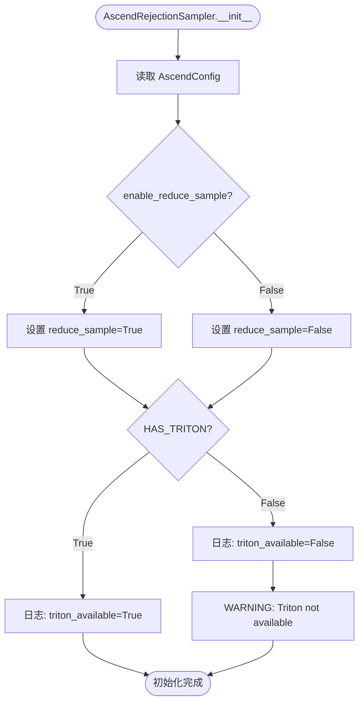

#### D.2 阶段 2：Target Logits 预处理

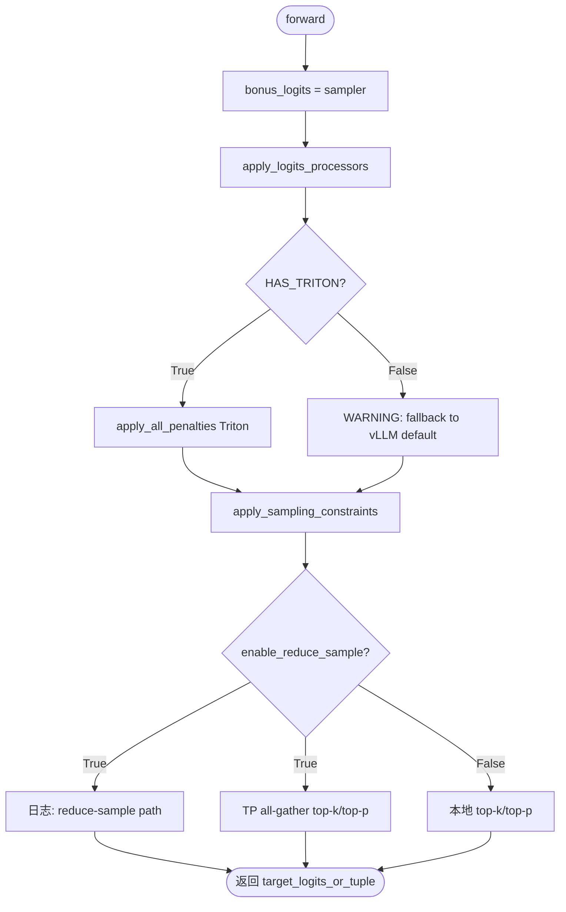

#### D.3 阶段 3：拒绝采样主逻辑与路径分发

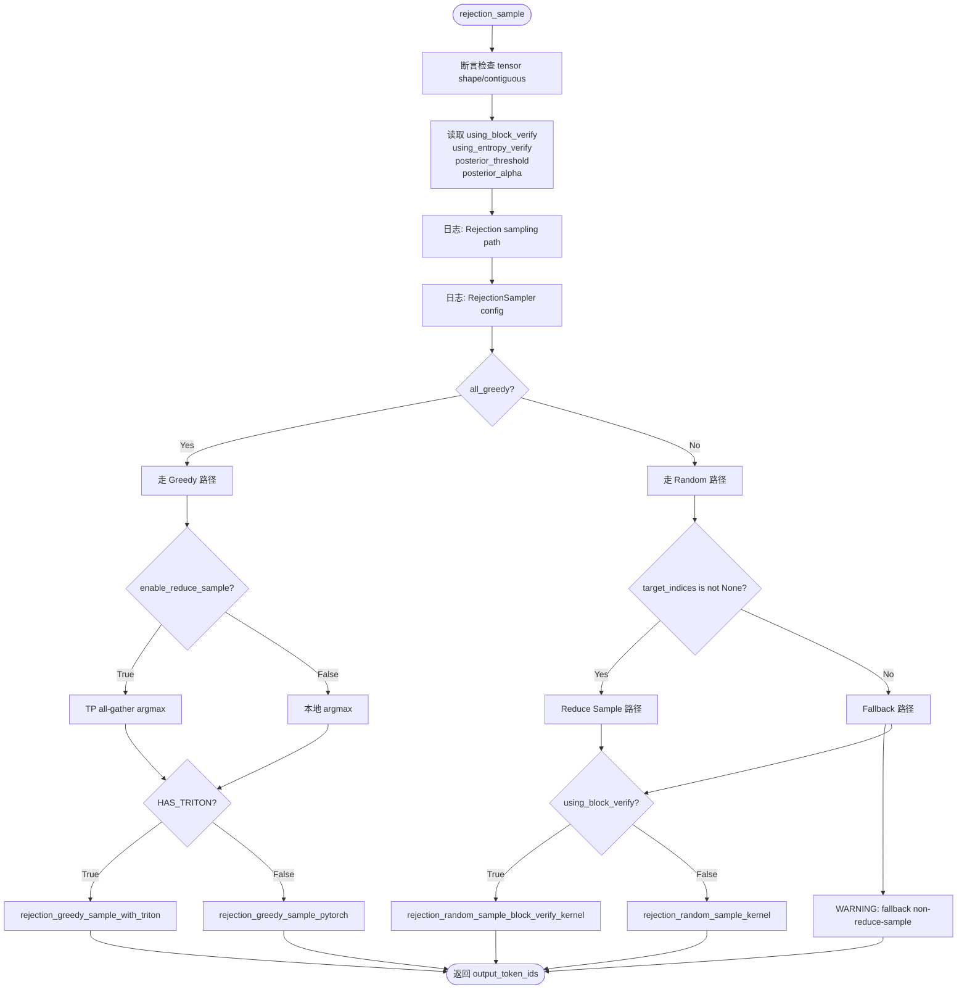

#### D.4 阶段 4：算子执行详细流程

```mermaid
flowchart TD
    subgraph Triton_Greedy ["Triton Greedy Kernel"]
        TG_Start[rejection_greedy_sample_triton] --> TG_Load[加载 draft_token / target_argmax]
        TG_Load --> TG_Loop[逐 token 比较]
        TG_Loop -->|match| TG_Accept[接受并继续]
        TG_Loop -->|mismatch| TG_Reject[拒绝并 break]
        TG_Accept --> TG_Bonus{全部接受?}
        TG_Bonus -->|Yes| TG_AppendBonus[追加 bonus token]
        TG_Bonus -->|No| TG_End
        TG_Reject --> TG_End
        TG_AppendBonus --> TG_End
    end

    subgraph Triton_Random ["Triton Random Kernel (Standard)"]
        TR_Start[rejection_random_sample_kernel] --> TR_Load[加载 draft_prob / target_prob / uniform_prob]
        TR_Load --> TR_Entropy{ENTROPY_VERIFY?}
        TR_Entropy -->|Yes| TR_E1[计算 entropy & threshold]
        TR_Entropy -->|No| TR_E2[uniform_prob 不变]
        TR_E1 --> TR_Cond{if draft_prob > 0<br/>and target_prob/draft_prob >= _uniform_prob}
        TR_E2 --> TR_Cond
        TR_Cond -->|Yes| TR_Accept[接受 draft token]
        TR_Cond -->|No| TR_Reject[拒绝，取 recovered_token]
        TR_Accept --> TR_Loop{还有 token?}
        TR_Reject --> TR_Loop
        TR_Loop -->|Yes| TR_Load
        TR_Loop -->|No| TR_Bonus{全部接受?}
        TR_Bonus -->|Yes| TR_AppendBonus[追加 bonus token]
        TR_Bonus -->|No| TR_End
        TR_AppendBonus --> TR_End
    end

    subgraph Triton_Block ["Triton Random Kernel (Block Verify)"]
        TB_Start[rejection_random_sample_block_verify_kernel] --> TB_Load[逐 token 加载]
        TB_Load --> TB_Cumul[累积 pi *= target_prob/draft_prob]
        TB_Cumul --> TB_Uniform[累积 uniform_prob]
        TB_Uniform --> TB_Entropy{ENTROPY_VERIFY?}
        TB_Entropy -->|Yes| TB_E1[动态阈值计算<br/>entropy驱动的threshold调整]
        TB_Entropy -->|No| TB_E2[threshold = 1]
        TB_E1 --> TB_Cond{if pi >= threshold * cum_uniform}
        TB_E2 --> TB_Cond
        TB_Cond -->|Yes| TB_Accept[last_accepted_pos 更新]
        TB_Cond -->|No| TB_Reject[停止累积]
        TB_Accept --> TB_Loop{还有 token?}
        TB_Reject --> TB_EndLoop
        TB_Loop -->|Yes| TB_Load
        TB_Loop -->|No| TB_EndLoop
        TB_EndLoop --> TB_Write[写入 accepted / recovered / bonus]
        TB_Write --> TB_End
    end
```

#### D.5 跨组件时序图（Rejection Sampling 调用链）

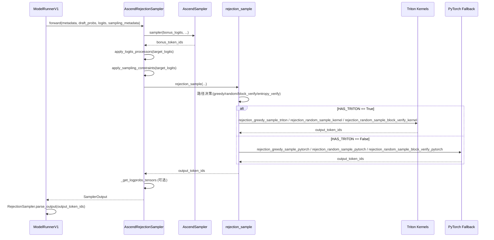

### E. 关键节点索引

| 阶段 | 关键日志 / 代码位置 | 说明 |
|------|---------------------|------|
| 1 | AscendRejectionSampler initialized (rejection_sampler.py) | 确认 Triton、reduce_sample 状态 |
| 1 | AscendSampler initialized (sampler.py) | 基础采样器就绪 |
| 2 | Using reduce-sample path for apply_sampling_constraints | TP all-gather 约束路径 |
| 2 | Using reduce-sample greedy sampling | Greedy 场景的 TP all-gather |
| 3 | RejectionSampler config: | 核心决策日志，汇总所有开关 |
| 3 | Rejection sampling path: | DEBUG 级别的决策参数 |
| 3 | Using fallback (non-reduce-sample) | 异常：配置与数据不一致 |
| 4 | rejection_random_sample_kernel / rejection_random_sample_block_verify_kernel (reject_sample.py) | Triton kernel 入口（无日志，需配置反推） |
| 4 | sample_recovered_tokens_kernel (reject_sample.py) | Recovered token 采样 kernel |
| 5 | PLACEHOLDER_TOKEN_ID (-1) | 输出中不应出现的保留值 |
| 全链路 | HAS_TRITON | 决定 Triton / PyTorch 分支 |
| 全链路 | enable_reduce_sample | 决定 TP all-gather 路径 |
| 全链路 | rejection_sampler_config | Block Verify / Entropy Verify 开关 |

### F. 故障场景流程

#### F.1 Triton 未启用导致性能劣化

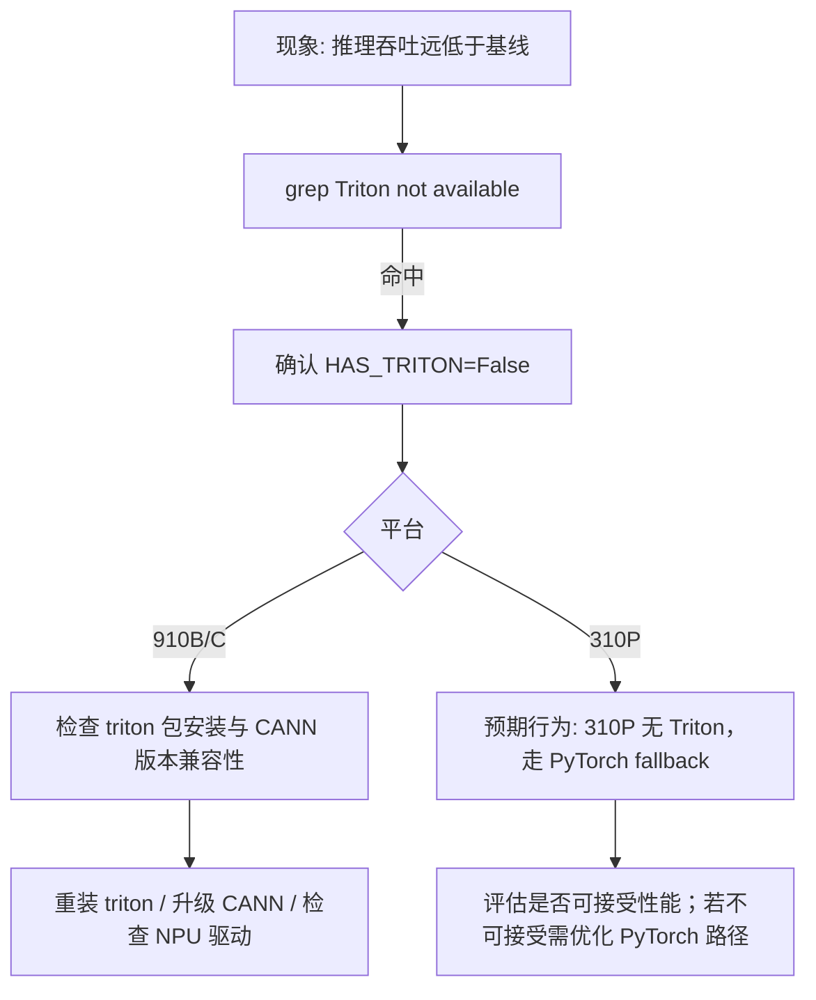

#### F.2 Reduce Sample 配置与数据不一致

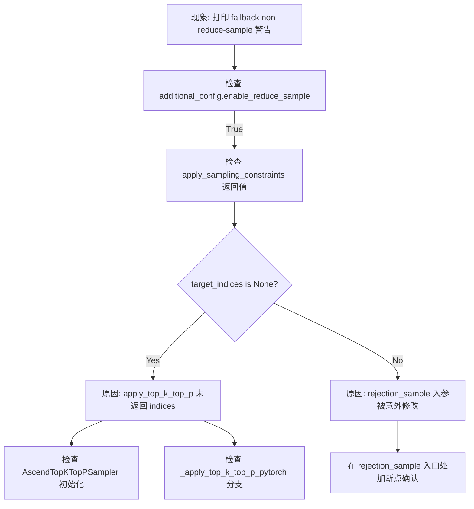

#### F.3 Block Verify / Entropy Verify 精度异常

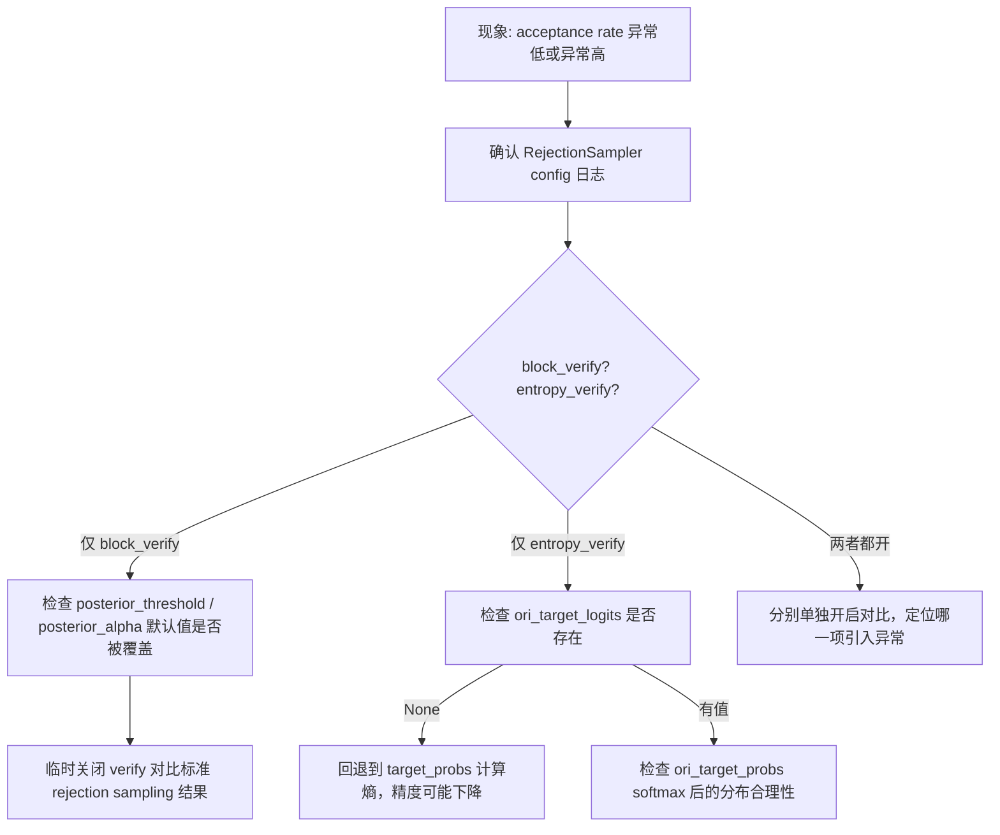

#### F.4 Placeholder Token（-1）泄漏

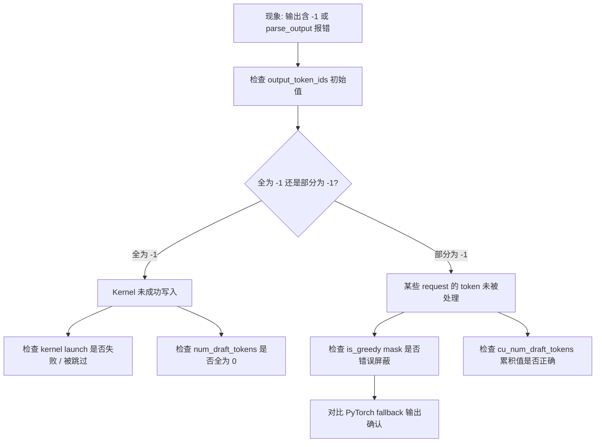

#### F.5 TP All-Gather 通信异常（Greedy / Reduce Sample）

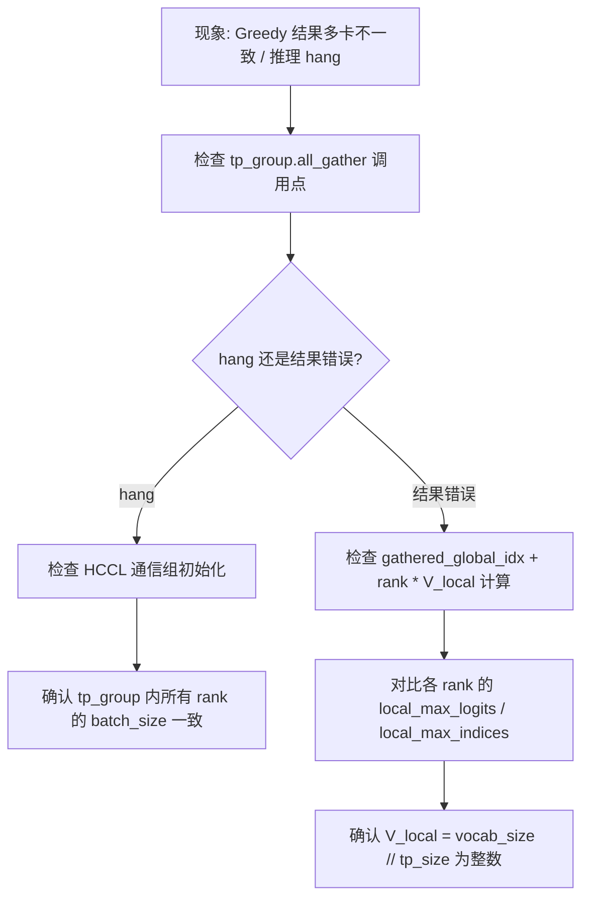

---

## 五、DFX 优化与定位手段

### 5.1 DFX 模块概览

拒绝采样 DFX 模块 `vllm_ascend/sample/rejection_sampler_dfx.py` 提供了以下能力：

| 能力 | 说明 | 触发方式 |
|------|------|----------|
| 指标收集 | acceptance_rate、triton_fallback_ratio、reduce_sample_hit_rate 等 | `VLLM_ASCEND_REJECTION_SAMPLER_DFX=1` |
| 错误码体系 | 标准化错误码（见下表），便于快速定位问题类型 | DFX 启用时自动检测 |
| Tensor 校验 | 检查 shape、contiguous、device 是否符合预期 | DFX 启用时自动执行 |
| 诊断日志 | Kernel launch 参数、fallback 路径、异常检测日志 | DFX 启用时自动输出 |
| 异常检测 | Placeholder token 泄漏、acceptance rate 异常为 0 | DFX 启用时自动检测并告警 |

### 5.2 错误码体系

| 错误码 | 含义 | 检测时机 | 常见原因 |
|--------|------|----------|---------|
| 0 | 正常 | 任何时候 | 无 |
| 1001 | Tensor shape mismatch | 输入校验 | 数据预处理错误、维度不匹配 |
| 1002 | Tensor is not contiguous | 输入校验 | Tensor 切片后未调用 contiguous() |
| 1003 | Tensor device mismatch | 输入校验 | 部分 tensor 在 CPU，部分在 NPU |
| 2001 | Triton kernel launch failed | Kernel launch | Grid/block_size 计算错误、参数不合法 |
| 3001 | Reduce sample config/data mismatch | 路径决策 | enable_reduce_sample=True 但 target_indices=None |
| 4001 | Placeholder token (-1) leaked | 输出校验 | Kernel 未成功写入、num_draft_tokens=0 |
| 4002 | Acceptance rate anomaly | 输出校验 | 连续 100+ token acceptance rate < 1% |
| 5001 | Block verify config invalid | 配置校验 | max_spec_len < 3 但 enable_block_verify=True |
| 5002 | Entropy verify missing logits | 路径决策 | enable_entropy_verify=True 但 ori_target_logits=None |
| 6001 | Greedy argmax mismatch across TP ranks | TP all-gather | HCCL 通信异常、rank 不一致 |

### 5.3 DFX 启用方式

```bash
# 方式 1：环境变量（推荐用于排障）
export VLLM_ASCEND_REJECTION_SAMPLER_DFX=1
vllm serve ...

# 方式 2：代码中动态启用
from vllm_ascend.sample.rejection_sampler_dfx import RejectionSamplerDFX
dfx = RejectionSamplerDFX()
dfx.enabled = True  # 动态启用

# 获取指标
summary = dfx.get_metrics_summary()
print(f"Acceptance rate: {summary['acceptance_rate']}")
print(f"Triton fallback ratio: {summary['triton_fallback_ratio']}")
```

### 5.4 新增日志

DFX 启用后新增的日志：

| 日志关键词 | 级别 | 说明 |
|-----------|------|------|
| `Launching rejection_greedy_sample_with_triton` | DEBUG | Triton kernel launch 参数（grid、block_size、batch_size、device） |
| `Falling back to PyTorch greedy rejection sample` | DEBUG | PyTorch fallback 路径触发 |
| `Placeholder token leak detected` | WARNING | 输出中检测到 -1，DFX 自动告警 |
| `Acceptance rate anomaly` | WARNING | Acceptance rate < 1%，DFX 自动告警 |
| `Metrics summary` | INFO | 每分钟输出一次指标汇总 |

### 5.5 排障流程优化

DFX 启用后的排障流程：

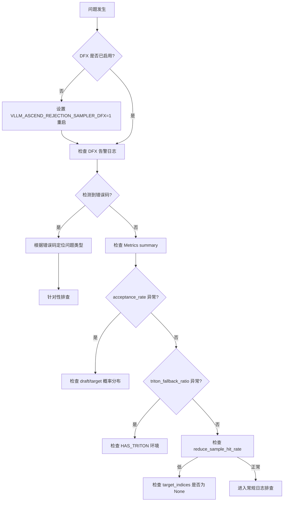

### 5.6 维护建议

1. **日常监控**：在生产环境建议启用 DFX（`VLLM_ASCEND_REJECTION_SAMPLER_DFX=1`），监控 acceptance_rate 和 triton_fallback_ratio 指标，设置告警阈值。
2. **版本升级前**：启用 DFX 运行回归测试，确认指标无异常波动。
3. **问题复现时**：启用 DFX 复现问题，获取完整指标和错误码，加速定位。
4. **性能优化**：DFX 的指标收集有轻微性能开销（约 0.5%），生产环境可按需开启；排障时建议始终开启。
